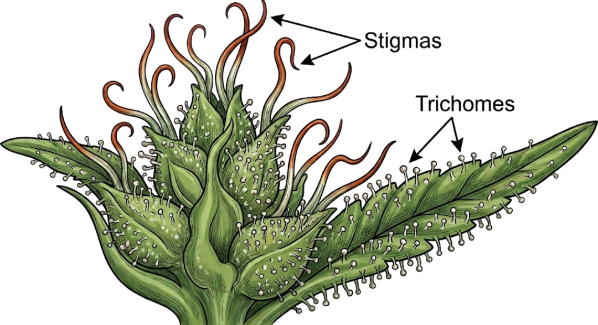
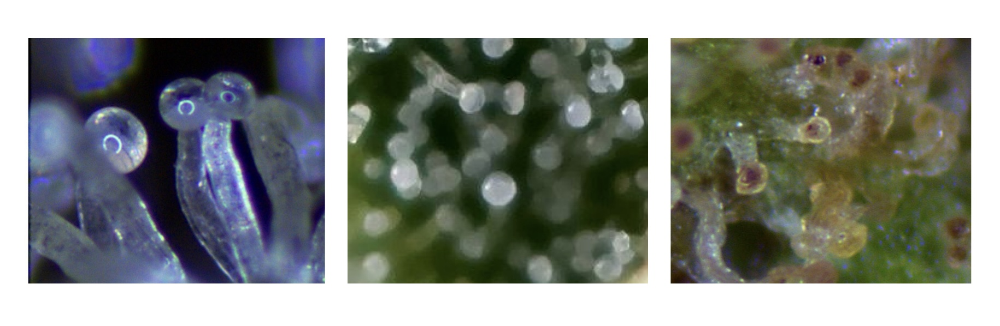
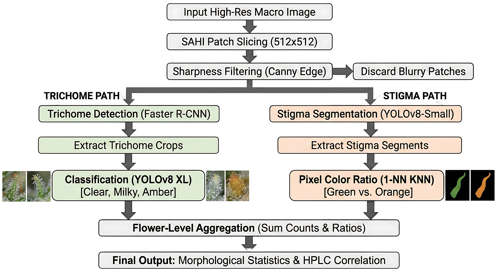
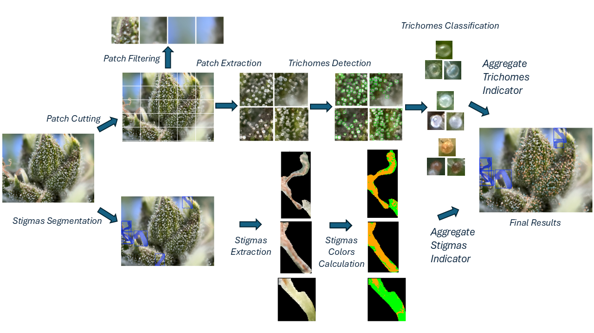
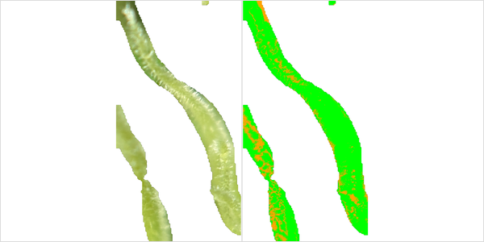
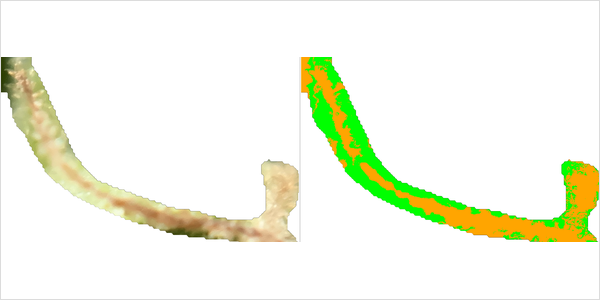
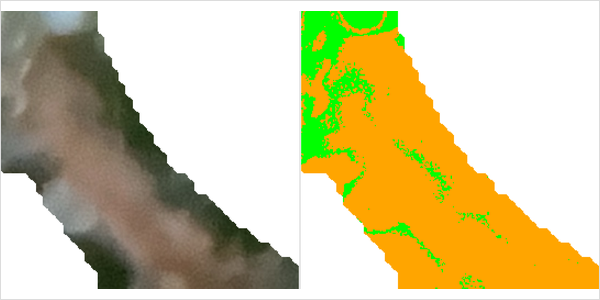

# Estimating Cannabis Flower Maturity in Greenhouse Conditions using Computer Vision

[-green)](https://www.mdpi.com/2077-0472/16/4/460)
[](https://doi.org/10.3390/agriculture16040460)
[-orange)](https://www.mdpi.com/journal/agriculture)

This repository contains the implementation of our research on automated cannabis flower maturity estimation using computer vision and deep learning techniques.

## Publication

**Estimating Cannabis Flower Maturity in Greenhouse Conditions Using Computer Vision**
*Etay Lorberboym, Silit Lazare, Polina Golshmid, Guy Shani*
Published in **Agriculture** (MDPI, Q1), Volume 16, Issue 4, 2026

[Read the full paper](https://www.mdpi.com/2077-0472/16/4/460) | [DOI: 10.3390/agriculture16040460](https://doi.org/10.3390/agriculture16040460)

<p align="center">
  
</p>

## Table of Contents

1. [Motivation](#motivation)
2. [Methodology](#methodology)
3. [Results](#results)
4. [Project Structure](#project-structure)
5. [Dataset](#dataset)
6. [Installation](#installation)

## Motivation

As cannabis flowers mature, trichomes shift from clear to milky to amber — a key indicator of cannabinoid content. Conventional assessment relies on manual loupe inspection, which is subjective, time-consuming, and inconsistent across observers.

<p align="center">
  
  
</p>

<p align="center">
  <em>(Top) Schematic of a cannabis flower showing stigma and trichome locations. (Bottom) Trichome color progression: clear → milky → amber.</em>
</p>

We replace manual inspection with smartphone-based macro imaging and computer vision to provide objective, reproducible maturity assessment.

<p align="center">
  
</p>

<p align="center">
  <em>(Left) Traditional loupe vs. smartphone macro imaging in greenhouse. (Right) Laboratory imaging setup.</em>
</p>

## Methodology

Our framework implements a dual-path pipeline for cannabis maturity assessment:

<p align="center">
  
</p>

<p align="center">
  
</p>

<p align="center">
  <em>(Upper path) Trichome detection and classification. (Lower path) Stigma segmentation and color ratio computation. Both paths aggregate results to produce flower-level maturity indicators correlated with HPLC-measured cannabinoid concentrations.</em>
</p>

## Results

### Trichome Detection Across Flowering Stages

Bounding boxes indicate detected trichomes with color-coded classification: blue (clear), orange (milky), and purple (amber).

<p align="center">
  
  
  
</p>

<p align="center">
  <em>Trichome detection results across the flowering period (Cultivar 805). Left: Early (DAF 51). Center: Mid (DAF 65). Right: Late (DAF 79).</em>
</p>

### Stigma Segmentation Across Flowering Stages

Blue overlays indicate detected stigma instances (bounding boxes and segmentation masks).

<p align="center">
  
  
  
</p>

<p align="center">
  <em>Stigma segmentation results across the flowering period (Cultivar 805). Left: Early (DAF 51). Center: Mid (DAF 65). Right: Late (DAF 79).</em>
</p>

### Stigma Color Classification

Each panel shows the original extracted stigma alongside its classified color map, where green pixels indicate immature tissue and orange pixels indicate mature tissue.

<p align="center">
  
  
  
</p>

<p align="center">
  <em>Stigma color classification using 1-NN pixel-level analysis (Cultivar 805). The progressive shift from green-dominant to orange-dominant reflects advancing maturity.</em>
</p>

## Project Structure

```
src/
├── common/                        # Shared utilities (detection, I/O, logging, metrics, visualization)
├── config/                        # Configuration (paths, settings)
├── classification/                # Trichome classification (FastAI-based training)
├── segmentation/                  # Detection & segmentation models
│   ├── handlers/                  # Detectron2, SAM, Ultralytics wrappers
│   ├── evaluation/                # Model evaluation (per-framework evaluators)
│   └── train_scripts/             # Training & tuning scripts
├── stigmas_segmentation/          # Stigma segmentation + color analysis
├── pipelines/                     # End-to-end processing pipelines
│   └── end_to_end/                # Full trichome & stigma analysis pipelines
├── data_preparation/              # Image I/O, patching, sharpness filtering
├── data_analysis/                 # Cannabis maturity correlation experiments
├── annotations/                   # Annotation handling & Segments.ai integration
├── app/                           # Streamlit web application
└── utils/                         # Additional utilities
```

## Dataset

Over 14,000 images collected in partnership with **RCK Science-Based Cannabis Genetics** across the final weeks of cannabis flower growth using an iPhone 14 Pro with 10X macro lens, under both greenhouse and laboratory conditions. Annotation was performed via [Segments.ai](https://segments.ai/).

## Installation

```bash
git clone https://github.com/elorberb/estimate-cannabis-maturity-with-cv.git
cd estimate-cannabis-maturity-with-cv
python -m venv venv
source venv/bin/activate
pip install -r requirements/requirements.txt
```

## Citation

If you use this code or our methodology in your research, please cite:

```bibtex
@Article{agriculture16040460,
AUTHOR = {Lorberboym, Etay and Lazare, Silit and Golshmid, Polina and Shani, Guy},
TITLE = {Estimating Cannabis Flower Maturity in Greenhouse Conditions Using Computer Vision},
JOURNAL = {Agriculture},
VOLUME = {16},
YEAR = {2026},
NUMBER = {4},
ARTICLE-NUMBER = {460},
URL = {https://www.mdpi.com/2077-0472/16/4/460},
ISSN = {2077-0472},
DOI = {10.3390/agriculture16040460}
}
```

## License

This project is for research purposes. Please contact the authors for commercial use inquiries.
